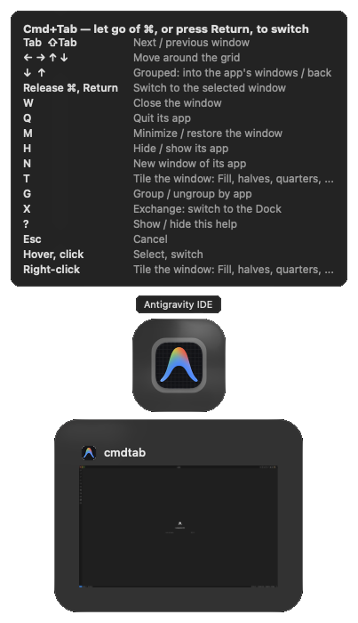
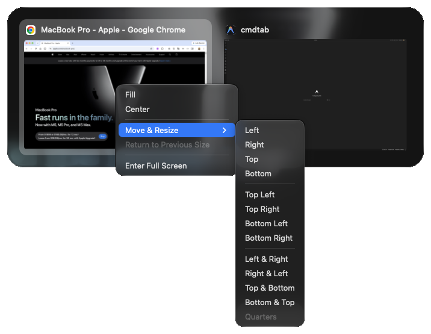
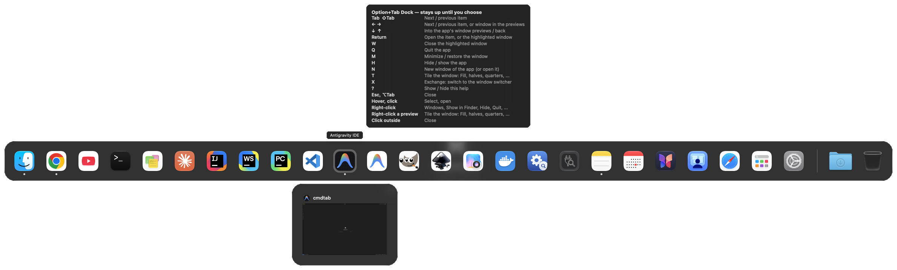

# CmdTab

A tiny menu bar app that makes **Cmd+Tab switch between windows** the way Alt+Tab works on Windows. Cmd+` keeps working as before. It also adds an on-demand [Dock on Option+Tab](#on-demand-dock-optiontab), and makes a window's [green button](#green-button) maximize instead of going full screen. Each of these can be turned off in the menu.

## Switcher


## Options


## Keys (while holding Cmd)

| Key | Action |
| --- | --- |
| Tab / Shift+Tab | Next / previous window |
| ← → ↑ ↓ | Move the selection around the grid (grouped: ↓ into the app's window previews, ← → between them, ↑ back) |
| Release Cmd, or press Return | Switch to the selected window |
| W | Close the selected window |
| Q | Quit the selected window's app |
| M | Minimize / restore the selected window |
| H | Hide / show the selected window's app |
| G | Group / ungroup windows by app |
| N | Open a new window of the selected window's app, and switch to it |
| T | The [tiling menu](#tiling-right-click) for the selected window (← ↑ ↓ → and Return to pick, Esc to close) |
| X | Exchange: close the switcher (without switching) and open the [Dock](#on-demand-dock-optiontab) instead |
| ? | Show / hide a bubble listing these keys and mouse actions |
| Esc | Cancel |
| Mouse hover / click | Select / switch (in icon view, hovering also shows the window title if the bubble doesn't already) |
| Right-click | The [tiling menu](#tiling-right-click) for that window |



A quick Cmd+Tab tap jumps straight to the previous window without showing the switcher. Windows are listed in most-recently-used order, with minimized windows last.

W, Q, M and H act on the selected window (or, grouped, the highlighted preview's window, or the app's most recent one) and keep the switcher open, so you can tidy up several windows in one go. Holding one of these keys acts only once. N opens a new window through the app's own **New Window** menu item (or one like **New Finder Window**), found by name rather than by shortcut, because Cmd+N and Cmd+Shift+N mean different things in different apps (in Finder, Cmd+Shift+N makes a new folder). An app without such an item beeps. Finder can't be quit with Q. Restoring a minimized window of a hidden app with M also unhides that app, the same as clicking the window's thumbnail in the Dock.

X swaps the switcher for the Dock and back. After X from the switcher, you're still holding Cmd: until you let go of it, keys typed with it go to the Dock (letting go doesn't close it). After X from the Dock, the switcher stays up until you press Return, Esc or click, since you aren't holding Cmd; press and hold Cmd to get the usual "let go to switch" back. X beeps if the other one is turned off in the menu.

### Grouping (G)

Press **G** (still holding Cmd) to show one icon per app instead of one per window, like the native switcher. The selected app's windows hang below its icon as previews, the same as in the [Dock](#on-demand-dock-optiontab): press ↓ to move into them, ← → to pick one, ↑ to go back. Letting go of Cmd switches to the highlighted preview's window, or else to the app's most recent window. Press **G** again to go back to one icon per window. In thumbnail view, G switches to these grouped app icons too (the selected app's window thumbnails hang below), and G again returns to thumbnails. Every Cmd+Tab starts ungrouped.

### Tiling (right-click)



Right-click a window's tile (or, grouped, an app's icon or a window preview), or press **T**, for a menu like the one under a window's green button (the [Dock](#on-demand-dock-optiontab)'s window previews have it too):

- **Fill**, **Center**. Like the green button, Fill toggles: while CmdTab has the window filled, the item reads **Restore Size** and puts it back
- **Move & Resize**: Left, Right, Top, Bottom; Top Left, Top Right, Bottom Left, Bottom Right; and arrangements that also place the next most recent windows: Left & Right, Right & Left, Top & Bottom, Bottom & Top, Quarters
- **Return to Previous Size**, after CmdTab has moved the window (shown as Restore Size above while it's filled)
- **Enter / Exit Full Screen**
- **Move to** another display, when you have more than one

Choosing one lays out the window on its display (minus the menu bar and Dock), closes the switcher and switches to it. While the menu is open, letting go of Cmd doesn't switch; closing the menu without a choice then switches, as letting go would have. CmdTab does these layouts itself; macOS's own Full Screen Tile (side-by-side full screen) isn't available to other apps.

## Views

- **App icons** (default): one large app icon per window, styled like the native macOS switcher. The selected icon gets a darker rounded square that hugs it, and its app name floats in a bubble above it, like the Dock's. When an app has more than one window listed, the bubble shows the window's title instead, so you can tell them apart. Otherwise, rest the pointer on an icon to see that window's title in a tooltip. With **Show Window Preview** on, a snapshot of the selected window also hangs below its icon; click it to switch to that window.
- **Window thumbnails**: a live snapshot of each window, with the app icon and window title above it. The selected tile gets the same darker rounded background as in icon view.

Choose between them in the menu. Thumbnails and window previews need **Screen Recording** permission (System Settings → Privacy & Security → Screen & System Audio Recording), and CmdTab must be relaunched after you grant it. Until then, they show the app icon. Minimized windows, windows of hidden apps and windows on other desktops can't be captured live, so they show their last snapshot, or the app icon if CmdTab hasn't captured them yet.

On macOS 26 and later, CmdTab's panels use the same Liquid Glass material as the native switcher, with a thin border in the opposite tone so they stand out against a background of the same tone. Earlier versions get a blurred, tinted panel instead. Either way they follow the **Appearance** setting.

## Window state badges

A small yellow badge marks windows you can't currently see:

| Badge | Meaning |
| --- | --- |
| ● dot | The window is minimized (yellow, like the minimize button in a window's title bar) |
| ◯ ring | The window's app is hidden |
| ◉ ring around the dot | Both |

Normal windows have no badge. In icon view the badge sits on the icon's bottom-right corner; in thumbnail view it's at the right end of the title row.

## Green button

A plain click on a window's green button maximizes the window to fill the screen (minus the menu bar and Dock) instead of taking it full screen. Click it again to put the window back where it was. Double-clicking a window's title bar does the same, instead of the system's Fill, which leaves a margin around the window. If you move or resize a maximized window, the next click maximizes it again rather than restoring.

Option-click the green button to go full screen, which is what a plain click does in standard macOS. Only clicks that land on the green button are affected, and hovering still shows the button's tiling menu. Turn this off in the menu to get the standard behavior back.

## On-demand Dock (Option+Tab)


Press **Option+Tab** to bring up a Dock where you're working (per the **Show On** setting), laid out like the real one: Finder, your pinned apps (without any spacer gaps you added), the recent apps section (if it's on in Dock settings), running apps that aren't pinned, then a divider, your Dock folders (such as Downloads), and the Trash. Running apps have a dot under the icon, hidden apps get the ◯ badge, and the selected item's name floats above it. It's handy with several displays, or with the real Dock hidden.

### Alongside the system Dock

This doesn't replace the system Dock: that stays where it is, and CmdTab's Dock is a second, temporary one that appears only while you want it. The two don't interfere. CmdTab reads your Dock's pinned apps, folders and Trash but never changes them, and opening an app from either one does the same thing. The usable area CmdTab uses for tiling and the green button leaves room for the system Dock, unless it's hidden.

To get a Dock that only shows up on demand, turn on auto-hide for the system Dock: System Settings → Desktop & Dock → **Automatically hide and show the Dock** (or press Option+Cmd+D). The system Dock then slides away until you move the pointer to its edge, and Option+Tab gives you CmdTab's Dock wherever you are, on whichever display you choose with **Show On**. Without auto-hide, both are simply available: use the system Dock by pointer and Option+Tab by keyboard.

Unlike Cmd+Tab, it stays up after you let go of Option, until you pick something, press Esc or Option+Tab again, or click outside it.

With **Show Window Previews** on (it's off by default), previews of the selected running app's windows hang below its icon, and they follow the selection. Click a preview, or press ↓ and then Return, to bring that window forward. The previews follow the **Include Minimized Windows**, **Include Windows of Hidden Apps** and **Include Windows from All Desktops** settings. Live snapshots need **Screen Recording** permission (see [Views](#views)); without it, previews show the app icon and window title. Minimized windows and windows on other desktops show their last snapshot, or the app icon.

| Key | Action |
| --- | --- |
| Tab / Shift+Tab | Next / previous item |
| ← → | Next / previous item, or window preview while in the previews |
| ↓ / ↑ | Into the selected app's window previews / back to the icons (with previews on); between rows if the Dock wraps into a grid |
| Return, or click | Open the item, like clicking it in the Dock, or bring the highlighted preview's window forward |
| W | Close the highlighted preview's window |
| Q | Quit the selected app |
| M | Minimize / restore the window: the highlighted preview's, or else the app's most recent one |
| H | Hide / show the selected app |
| N | Open a new window of the selected app (an app that isn't running, or has no windows, just opens, as when clicked) |
| T | The [tiling menu](#tiling-right-click) for the same window as M |
| G | Beeps: the Dock is already one icon per app (G groups in the switcher) |
| X | Exchange: close the Dock and open the Cmd+Tab window switcher instead |
| ? | Show / hide a bubble listing these keys and mouse actions |
| Esc, Option+Tab, or click outside | Close |
| Any other key | Close, and the key goes to the app you're in |



Opening an app activates it (launching it if needed), the same as a Dock click. Folders open in Finder.

**Right-click** a tile for its menu:

- **Running app:** its windows (choose one to bring it forward; ◆ marks minimized ones), Show in Finder, Hide/Show, Quit. Hold Option for Force Quit.
- **Other apps and folders:** Open, Show in Finder.
- **Trash:** Open, Empty Trash.
- **Window preview** (with **Show Window Previews** on): the [tiling menu](#tiling-right-click) for that window. Choosing a layout applies it, closes the Dock and brings the window forward; closing the menu without a choice leaves the Dock open.

The menus never change your real Dock (no Keep in Dock / Remove from Dock). Items an app adds to its own Dock menu, such as a browser's New Window, aren't available to other apps, so they're not shown. The Dock follows the same **Show On** choice as the switcher.

## Menu

The menu bar icon has these options:

- **Cmd+Tab Shows Windows**: turn the window switcher on or off. While it's off, the system Cmd+Tab works as usual. Its options are indented under it:
  - **Include Minimized Windows** / **Include Windows of Hidden Apps**: show or skip those windows.
  - **Include Windows from All Desktops**: also list windows on other Spaces (desktops), including full-screen ones. Picking one switches to its desktop. Off by default.
  - **Show App Icons** / **Show Window Thumbnails**: choose the view.
    - **Show Window Preview** (icon view, off by default): a snapshot of the selected window hangs below its icon, like the Dock's window previews. Click it to switch to that window.
- **Option+Tab Shows Dock**: turn the [Dock](#on-demand-dock-optiontab) on or off. It works independently of **Cmd+Tab Shows Windows**.
  - **Show Window Previews**: preview the selected app's windows under its icon in the Dock. Off by default.
- **Show On**: where the switcher and the Dock appear. **All Displays** (the default) shows them on every display; arrow keys follow the grid on the pointer's display. **Display with Pointer** or **Display with Active Window** (the display showing most of the frontmost window) shows them on just one.
- **Appearance**: System, Light or Dark, for CmdTab's panels (the switcher, the Dock, previews and name bubbles) only.
- **Green Button Toggles Maximize Instead of Full Screen**: see [Green button](#green-button). On by default.
- **Keyboard Shortcuts…**: both lists of keys and mouse actions, side by side in a window. The switcher and the Dock also show their list (the same one ? shows) the first time each appears.
- **Launch at Login**
- **Accessibility Permission**: shows whether it's granted, and opens System Settings if it isn't.
- **Quit CmdTab**

## Install

CmdTab runs on macOS 14 or later, on Apple silicon and Intel Macs.

### Download (no developer tools needed)

1. Download `CmdTab-<version>.zip` from the [latest release](https://github.com/sandipchitale/cmdtab/releases/latest), unzip it, and move **CmdTab.app** to your Applications folder.
2. CmdTab isn't notarized by Apple (notarization needs a paid Apple developer account, which this free project doesn't use), so macOS blocks it the first time. To allow it, run this once in Terminal:

   ```sh
   xattr -dr com.apple.quarantine /Applications/CmdTab.app
   ```

   Or, without Terminal: try to open CmdTab, then go to System Settings → Privacy & Security, scroll down, and click **Open Anyway**. (On macOS 15 and later, right-clicking the app and choosing Open no longer gets past this.)
3. Open CmdTab and grant **Accessibility** permission when asked (System Settings → Privacy & Security → Accessibility). It starts working as soon as you turn it on.
4. For window thumbnails and previews, also grant **Screen Recording** permission and relaunch CmdTab (see [Views](#views)).

Each release lists the zip's SHA-256 checksum, so you can check your download with `shasum -a 256 CmdTab-<version>.zip`.

### Build from source

If you have Apple's free command-line developer tools (`xcode-select --install`), you can build CmdTab yourself. An app you build on your own Mac isn't blocked by Gatekeeper, so there's no step 2.

```sh
./install.sh           # builds, signs, copies to /Applications, launches
```

The first time you run it, `install.sh` creates a self-signed code-signing certificate called "CmdTab Local Signing" in your login keychain. macOS asks for your password to trust it, and may ask once whether `codesign` can use the key (choose **Always Allow**). Every build is then signed with that certificate, so the Accessibility and Screen Recording grants survive rebuilds. Then grant the permissions as in steps 3 and 4 above.

Builds are universal (Apple silicon and Intel).

`./build.sh` alone builds `build/CmdTab.app` with an ad-hoc signature, and `./build.sh install` installs that. macOS treats each ad-hoc build as a new app, so you'd have to grant permissions again every time.

## Notes

- While CmdTab is running with **Cmd+Tab Shows Windows** on, it turns off the system Cmd+Tab app switcher. It turns it back on when you quit CmdTab or uncheck **Cmd+Tab Shows Windows**.
- Permissions are tied to the code signature. When it changes (for example, the first `install.sh` run after an ad-hoc build), the install resets the old Accessibility and Screen Recording entries and you grant them once more. To sign with your own certificate instead, set `CODESIGN_IDENTITY`.
- Like the Windows default, only windows on the current Space (desktop) are shown, unless **Include Windows from All Desktops** is on. macOS's Accessibility API doesn't list windows on other desktops, so CmdTab finds them through windows it has already seen. A window that was opened directly on another desktop, and that you haven't visited since CmdTab started, may be missing until you visit that desktop once. Windows on other desktops can't be captured live, so thumbnails and previews of them show their last snapshot or the app icon.

## License

[MIT](LICENSE) © 2026 Sandip Chitale
