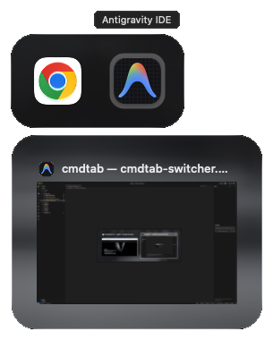
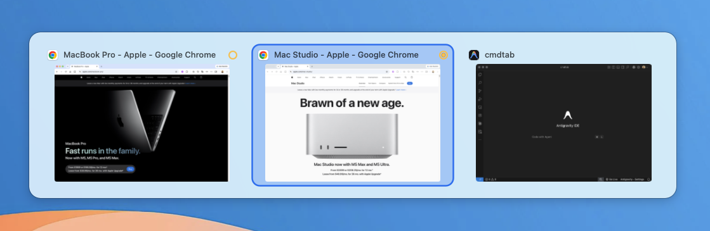
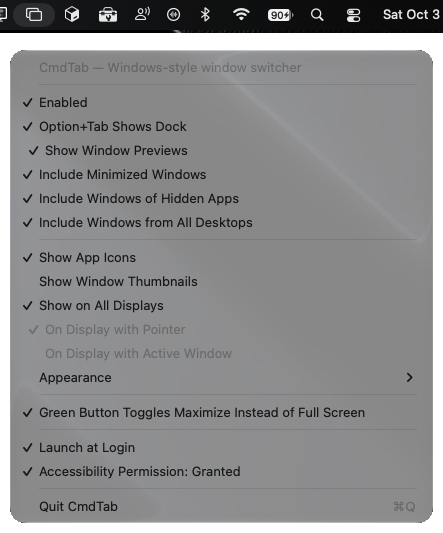
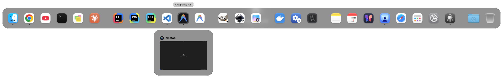

# CmdTab

A tiny menu bar app that makes **Cmd+Tab switch between windows** the way Alt+Tab works on Windows. Nothing else changes, and Cmd+` keeps working as before.

## Switcher





## Options



## Keys (while holding Cmd)

| Key | Action |
| --- | --- |
| Tab / Shift+Tab | Next / previous window |
| ← → ↑ ↓ | Move the selection around the grid |
| Release Cmd, or press Return | Switch to the selected window |
| W | Close the selected window |
| Q | Quit the selected window's app |
| M | Minimize / restore the selected window |
| H | Hide / show the selected window's app |
| Esc | Cancel |
| Mouse hover / click | Select / switch (in icon view, hovering also shows the window title) |

A quick Cmd+Tab tap jumps straight to the previous window without showing the switcher. Windows are listed in most-recently-used order, with minimized windows last.

W, Q, M and H act on the selected tile and keep the switcher open, so you can tidy up several windows in one go. Holding one of these keys acts only once. Finder can't be quit with Q. Restoring a minimized window of a hidden app with M also unhides that app, the same as clicking the window's thumbnail in the Dock.

## Views

- **App icons** (default): one large app icon per window, styled like the native macOS switcher. The selected icon gets a darker rounded square that hugs it, and its app name floats in a bubble above it, like the Dock's. Rest the pointer on an icon to see that window's title in a tooltip.
- **Window thumbnails**: a live snapshot of each window, with the app icon and window title above it. The selected tile gets the same darker rounded background as in icon view.

On macOS 26 and later, the switcher panel uses the same Liquid Glass material as the native switcher. Earlier versions get a blurred, tinted panel instead. Either way it follows the **Appearance** setting.

Choose between them in the menu. Thumbnails need **Screen Recording** permission (System Settings → Privacy & Security → Screen & System Audio Recording), and CmdTab must be relaunched after you grant it. Until then, tiles show the app icon. Minimized windows and windows of hidden apps can't be captured live, so they show their last snapshot, or the app icon if CmdTab hasn't captured them yet.

## Window state badges

A small yellow badge marks windows you can't currently see:

| Badge | Meaning |
| --- | --- |
| ● dot | The window is minimized |
| ◯ ring | The window's app is hidden |
| ◉ ring around the dot | Both |

Normal windows have no badge. In icon view the badge sits on the icon's bottom-right corner; in thumbnail view it's at the right end of the title row.

## Green button

A plain click on a window's green button maximizes the window to fill the screen (minus the menu bar and Dock) instead of taking it full screen. Click it again to put the window back where it was. If you move or resize a maximized window, the next click maximizes it again rather than restoring.

Option-click the green button to go full screen, which is what a plain click does in standard macOS. Only clicks that land on the green button are affected, and hovering still shows the button's tiling menu. Turn this off in the menu to get the standard behavior back.

## Dock (Option+Tab)



Press **Option+Tab** to bring up a Dock on the current display, laid out like the real one: Finder, your pinned apps with their spacers, the recent apps section (if it's on in Dock settings), running apps that aren't pinned, then a divider, your Dock folders (such as Downloads), and the Trash. Running apps have a dot under the icon, hidden apps get the ◯ badge, and the selected item's name floats above it. It's handy with several displays, or with the real Dock hidden.

Unlike Cmd+Tab, it stays up after you let go of Option, until you pick something, press Esc or Option+Tab again, or click outside it.

When the selected app is running, previews of its windows hang below its icon, and they follow the selection. Click a preview, or press ↓ and then Return, to bring that window forward. The previews follow the **Include Minimized Windows**, **Include Windows of Hidden Apps** and **Include Windows from All Desktops** settings. Live snapshots need **Screen Recording** permission (see [Views](#views)); without it, previews show the app icon and window title. Minimized windows and windows on other desktops show their last snapshot, or the app icon.

| Key | Action |
| --- | --- |
| Tab / Shift+Tab | Next / previous item |
| ← → | Next / previous item, or window preview while in the previews |
| ↓ / ↑ | Into the selected app's window previews / back to the icons |
| Return, or click | Open the item, like clicking it in the Dock, or bring the highlighted preview's window forward |
| W | Close the highlighted preview's window |
| Q | Quit the selected app |
| H | Hide / show the selected app |
| Esc, Option+Tab, or click outside | Close |
| Any other key | Close, and the key goes to the app you're in |

Opening an app activates it (launching it if needed), the same as a Dock click. Folders open in Finder.

**Right-click** a tile for its menu:

- **Running app:** its windows (choose one to bring it forward; ◆ marks minimized ones), Show in Finder, Hide/Show, Quit. Hold Option for Force Quit.
- **Other apps and folders:** Open, Show in Finder.
- **Trash:** Open, Empty Trash.

The menus never change your real Dock (no Keep in Dock / Remove from Dock). Items an app adds to its own Dock menu, such as a browser's New Window, aren't available to other apps, so they're not shown. The Dock follows the same **Show on All Displays** / display choice as the switcher.

## Menu

The menu bar icon has these options:

- **Enabled**: turn CmdTab on or off. While it's off, the system Cmd+Tab works as usual.
- **Option+Tab Shows Dock**: turn the [Dock](#dock-optiontab) on or off. It works independently of **Enabled**.
- **Include Minimized Windows** / **Include Windows of Hidden Apps**: show or skip those windows.
- **Include Windows from All Desktops**: also list windows on other Spaces (desktops), including full-screen ones. Picking one switches to its desktop. Off by default.
- **Show App Icons** / **Show Window Thumbnails**: choose the view.
- **Show on All Displays**: show the switcher on every display, not just the one with the pointer. On by default. Arrow keys follow the grid on the pointer's display. When it's off, choose **On Display with Pointer** or **On Display with Active Window** (the display showing most of the frontmost window).
- **Appearance**: System, Light or Dark, for the switcher panel only.
- **Green Button Toggles Maximize Instead of Full Screen**: see [Green button](#green-button). On by default.
- **Launch at Login**
- **Accessibility Permission**: shows whether it's granted, and opens System Settings if it isn't.
- **Quit CmdTab**

## Build & install

```sh
./install.sh           # builds, signs, copies to /Applications, launches
```

On first launch, grant **Accessibility** permission in System Settings → Privacy & Security → Accessibility. CmdTab starts working as soon as you turn it on. You don't need to relaunch.

The first time you run it, `install.sh` creates a self-signed code-signing certificate called "CmdTab Local Signing" in your login keychain. macOS asks for your password to trust it, and may ask once whether `codesign` can use the key (choose **Always Allow**). Every build is then signed with that certificate, so the Accessibility and Screen Recording grants survive rebuilds.

For window thumbnails, also grant **Screen Recording** permission and relaunch CmdTab (see [Views](#views)).

`./build.sh` alone builds `build/CmdTab.app` with an ad-hoc signature, and `./build.sh install` installs that. macOS treats each ad-hoc build as a new app, so you'd have to grant permissions again every time.

## Notes

- While CmdTab is running and enabled, it turns off the system Cmd+Tab app switcher. It turns it back on when you quit CmdTab or uncheck **Enabled**.
- Permissions are tied to the code signature. When it changes (for example, the first `install.sh` run after an ad-hoc build), the install resets the old Accessibility and Screen Recording entries and you grant them once more. To sign with your own certificate instead, set `CODESIGN_IDENTITY`.
- Like the Windows default, only windows on the current Space (desktop) are shown, unless **Include Windows from All Desktops** is on. macOS's Accessibility API doesn't list windows on other desktops, so CmdTab finds them through windows it has already seen. A window that was opened directly on another desktop, and that you haven't visited since CmdTab started, may be missing until you visit that desktop once. Windows on other desktops can't be captured live, so in thumbnail view they show their last snapshot or the app icon.

## License

[MIT](LICENSE) © 2026 Sandip Chitale
